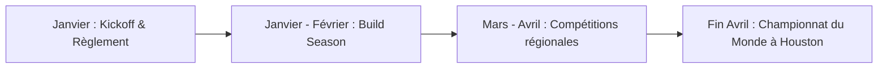

# F1.1 - Qu'est-ce que la FRC ?

Bienvenue dans la **FIRST Robotics Competition (FRC)**, souvent qualifiée de *"sport d'esprit ultime"*. FRC allie la rigueur scientifique de l'ingénierie à l'excitation d'un tournoi sportif mondial.

:::info
**FIRST** est l'acronyme de **For Inspiration and Recognition of Science and Technology**. Fondée en 1989 par l'inventeur Dean Kamen, cette organisation mondiale a pour mission d'inspirer les jeunes à devenir des leaders scientifiques et technologiques.
:::

---

## 🌟 La Philosophie Fondamentale de FIRST

Le succès en FRC ne se mesure pas seulement au nombre de points marqués sur le terrain, mais à la façon dont les équipes collaborent. Deux concepts guident chaque décision et action :

### 1. Le Professionnalisme Coopératif (Gracious Professionalism)
C'est une éthique de respect mutuel et de gentillesse, même au cœur de la compétition la plus féroce. Cela signifie :
* Aider les autres équipes, y compris ses adversaires directs (ex. prêter des pièces, des outils ou aider à coder un robot adverse).
* Encourager et valoriser le travail de chacun.
* Gagner avec humilité et perdre avec dignité.

### 2. La Coopertition®
Contraction de *Coopération* et *Compétition*. En FRC, nous rivalisons fermement sur le terrain tout en nous entraidant en coulisses. Une alliance de match peut être composée d'équipes qui s'affronteront au match suivant !

---

## 🎯 Comment se Déroule une Saison FRC ?

Chaque saison suit un calendrier rigoureux de plusieurs mois :

### Le Kickoff (Lancement)
Chaque année, le premier samedi de janvier, FIRST dévoile un tout nouveau jeu à l'échelle mondiale dans une vidéo de présentation animée. C'est à ce moment que le manuel de jeu officiel est publié.
* [Manuel PDF Officiel FRC 2026](https://firstfrc.blob.core.windows.net/frc2026/Manual/2026FRCGameManual.pdf)
* [Visualiseur de Manuel Non-Officiel FRC](https://frc-manual.recg.org/)

### La Période de Construction (Build Season)
Pendant environ 6 à 8 semaines, l'équipe collabore intensivement pour analyser le jeu, concevoir un prototype, modéliser le robot en 3D (CAD), le fabriquer, le câbler, et programmer son autonomie ainsi que son contrôle manuel.

---

## 🏟️ Anatomie d'un Match FRC

Un match de compétition FRC dure **2 minutes et 30 secondes** et oppose deux alliances de 3 robots : **l'Alliance Bleue** et **l'Alliance Rouge**.

### Les Différentes Phases d'un Match
1. **La Phase Autonome (15 secondes)** : Les robots se déplacent et marquent des points uniquement grâce à du code préprogrammé. Les pilotes n'ont pas le droit de toucher aux manettes.
2. **La Phase Téléopérée (2 minutes et 15 secondes)** : Les étudiants prennent le contrôle manuel du robot via des manettes pour réaliser les tâches du jeu (attraper des notes, lancer des projectiles, grimper).
3. **Le Mode Endgame (Généralement les 20 dernières secondes)** : Une tâche complexe et payante en points (comme se suspendre à une chaîne, grimper sur une plateforme oscillante ou s'amarrer) doit être réalisée juste avant la fin du temps réglementaire.

:::warning
**Sécurité en Match !**
Les robots pèsent jusqu'à 56 kg (125 lbs) hors batterie et bumpers et se déplacent à plus de 5 m/s. Le port des **lunettes de sécurité** est obligatoire en permanence dans les stands (Pit Area) et autour du terrain de jeu !
:::

---

## 📚 Supports Supplémentaires

Pour aller plus loin sur la compréhension générale de la compétition FRC, veuillez consulter ces supports officiels :
* 🖥️ **Slides de Présentation :** [Slides F1.1 - Introduction à la FRC](https://docs.google.com/presentation/d/1HGakEB6jhE4WON5OCA4wB5tr2pTyJo5cIO3TNS4YmfQ/edit)
* 🎥 **Vidéo d'introduction :** [Video D1.1 - Overview of FRC](https://www.youtube.com/watch?v=86NCQfrjNr0)
* 💻 **NASA FRC Resource Library :** [NASA FRC Hub](https://robotics.nasa.gov/frc-resources/)
